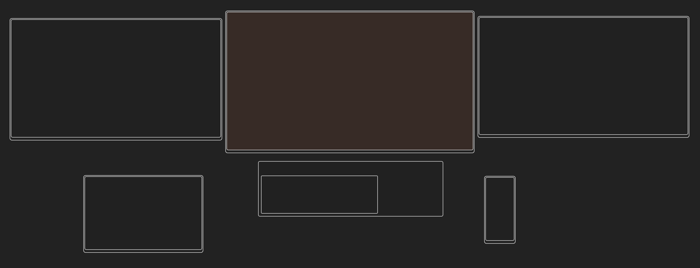

# Compare Monitor Size

This site is for easy and visual comparison of each monitor size.  
[GitHub Pages is here.](https://m-yoc.github.io/CompareMonitorSize/)

## Used Tech

This system uses only the frontend.  
Data are recorded in your browser and there is no communication with the server.

- TypeScript
- SCSS
- Vue.js (ver3: Composition API)
    - Pinia.js (State Management Library)
- idb (IndexedDB API)
- Webpack
- Docker

